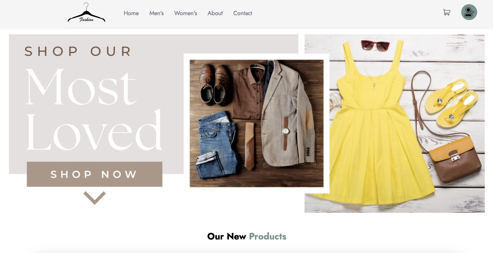

<h1 align="center"> Fashion store</h1>

<table>
  <tr>
    <td>
      
Our project aims to revolutionize the online clothing shopping experience by providing style recommendations based on individual preferences and body types. Facilitating the process of purchasing clothes from anywhere</b>

      
 

      
 

      
- 📫 How to reach me: <b><a href=adomeyou@gmail.com alt=email target="_blank">adomeyou@gmail.com</a></b>

      
- ⚡ Fun fact: <b>ALX Cohort 16</b>

    </td>
    <td>
      <h3 align="left">Connect with me:</h3>
      

      
      
      
      
      

      <h3 align="left">Languages and Tools:</h3>
      

      
      
      
      
      
      
      
      

  </tr>
</table>

## Feedback

If you have any feedback, please reach out to us at adomeyou@gmail.com

## Links

## Badges

Add badges from somewhere like: [shields.io](https://shields.io/)

## Authors

    
Fatima Ez-Zahra Kouirs

    <ul>
    <li><a href="https://www.github.com/kouirsfatima">Github</a></li>
    <li><a href="https://www.twitter.com/Rosenherz">Twitter</a></li>
    <li><a href="mailto:berlinefatima@gmail.com">e-mail</a></li>
    </ul>

    
Mouad Khanouch

    <ul>
    <li><a href="https://www.github.com/">Github</a></li>
    <li><a href="https://www.twitter.com/">Twitter</a></li>
    <li><a href="mailto:mouadmouadkhanouch@gmail.com">e-mail</a></li>
    </ul>

    
Ouail Berramou

    <ul>
    <li><a href="https://www.github.com/Ouailb">Github</a></li>
    <li><a href="https://www.twitter.com/">Twitter</a></li>
    <li><a href="mailto:adomeyou@gmail.com">e-mail</a></li>
    </ul>

